# Route planner to the CMD Device Lab 🗺
**In this application you can plan your route from home, or another location, to the CMD device lab! This application is all about accessability!💫**

[Link to website](https://route-planner-browser-tech.herokuapp.com)


## Table of Contents
* **[How to install](#how-to-install)**
* **[Use case](#use-case)**
* **[Progressive Enhencement](#progressive-enhancement)**
* **[Walktrough the application](#walk-trough-the-application)**
* **[Accessability](#accessability)**
* **[Feature detection](#accessability)**
* **[Supplement for retake](#supplement-for-retake)**
* **[Resources](#resources)**
* **[Credits](#credits)**
* **[License](#license)**

## How to install

Before installing make sure you have installed node.js and npm.
Choose or make a new directory.
Load the template into your directory.

```bash
git clone https://github.com/chelseadoeleman/route-planner.git
```

Make sure you are in the right directory 
```bash
cd route-planner
```

Check if you have the latest version of npm.
Install the dependencies in [package.json](./package.json)
```bash
npm install
```

## Use case

For this project I chose the following user case **"Plan your route from my home to the CMD Device Lab"**. First off I sketched a wireflow with the core functionality of how the application should behave and how interaction works within the application.

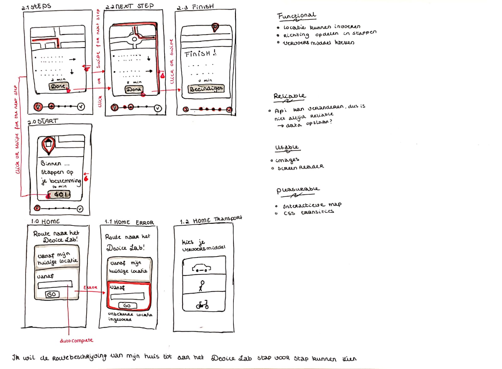

In the first place I found it hard to divide my application into four layers: functional, reliable, usable and pleasurable. Looking back at it now, I would like to add some changes to my sketch.

*   Functional
    *   The route needs to be divided in steps to get from my home to the Device lab.
    *   Offer different transportation options to the user.
*   Reliable
    *   The user can find the route to the Device lab from my home, no. matter. what.
    *   API's are not reliable.
*   Usable
    *   Make sure it's accessable for everyone
    *   Make sure that the core functionality works in almost 'every' browser.
*   Pleasurable
    *   Add some crazy styles and transitions to CSS.
    *   Add Javascript to go all out. Like making sure the user can also plan their route to the Device Lab to other places 😊.

## Progressive Enhancement

**Browser tests**
*   Internet Explorer *(v5-v11) tested with virtualBox IE11 and other version by opening the inspector*
    *   v11 works fine! Some weird things I noticed is that @supports is not yet supported in IE11 however flexbox is. So at first I checked if flexbox was supported with ```@supports```, but this totally broke the styling.
    
    *   From v10 some functionality dissapears from the application, due to the fact that mapbox isn't supported below IE11.
    
    *   After v8 it becomes a complete mess, where the css looks a bit wonky. However the user is still able to walk through all the steps.
    

*   Safari *(latest)*
    *   Works fine, but just using the keyboard to navigate proves to be quite difficult even when using ```<a>``` html tag it doesn't focus on these links, ```<button>``` can be focused on with tabs.

*   Opera mini *(latest)*
    *   Everything seems to be working here even mapbox! Eventhough it can be quite slow.
    
    

*   Edge *(latest)*
    *   See IE11 explanation.

*   Firefox *(latest)*
    *   Same problem as safari when navigating with the keyboard, other functions do work properly.

*   Chrome *(latest)*
    *   Works accordingly, because I developed in this browser.

*   Opera Neon *(latest)*
    * All features work in Opera Neon!

## Walktrough the application


The route is configured step by step with directions that lead to you to your destination, in this case the Device Lab. The user is also able to choose their preferred type of transport to get to their destination. 

The application is set up with **node** and an **express** server. The pages are rendered with **ejs**. The core of the application is build with semantic HTML 5, which isn't supported in every browsers. Elements like ```<main>``` or ```<section>``` Are just left empty above their children which were included in that element, in certain browsers like IE8. Javascript and CSS are seperated from the HTML. When Javascript is turned of the user is still able to use the core functionality of the application. Only Mapbox won't be available anymore at that time, which provide the user with dynamic routes.

The user is also able to go from point 'a' to 'b' by providing the application their location. The application will only ask the user for their location if they actually choose the link, to go from their current location.

In the end I didn't have enough time to implement something for a bad broadband connection. But Mapbox does provide an offline Map, which can be used to display the routes. If the user is able to save their location, where they want to calculate their route from. They can easily start the navigation, when they do have a better internet connection. These are just a few enhancements, which could make the application a lot better.

## Accessability


<details>
  <summary>Colors</summary>

  After running an audit I got the application had an accessability of **100** This includes all the colors. However Mapbox isn't really that visible when setting my clarity to the lowest point. Only people with normal eye sight are propably able to see this correctly. 

  I tested my application on colorblindness with [Sim Daltonism](https://michelf.ca/projects/sim-daltonism/). After using this feature everything was still visible for the user.
    

</details>

<details>
  <summary>Cookies</summary>

  After disabling cookies the application still works accordingly, this was done with the developer tools extension in Chrome.
</details>


<details>
  <summary>Custom fonts</summary>

  I did use a custom font, however after turning this off it just falls back on the fallback I had defined in my CSS. In this case "Arial", "Helvetica" or some other "Sans-serif" font the user defined in their preferences. It falls back on the fallback font in IE8 and versions before that.
</details>

<details>
  <summary>Images</summary>

    I turned images off with the developer tools in Chrome. There was an alt text provided for that image, but it doesn't load. The steps which are most important part are still visible to the user. 


</details>

<details>
  <summary>Internet broadband</summary>

    When the internet connection is slow it does take some time to fetch data from the API however some  content is directly shown, though this is not dynamic yet. I also takes some time for Mapbox to load, but this doesn't take away from it's core functionality of this application. It can however be improved see 

[Walktrough the application](#walk-trough-the-application) for more information

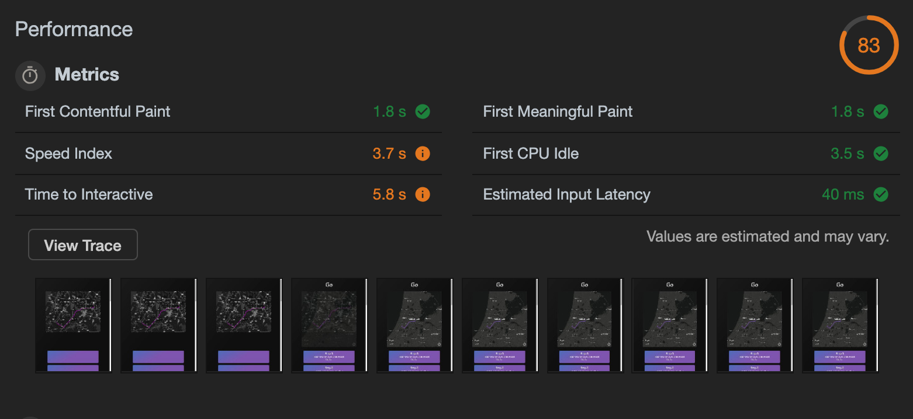

</details>


<details>
  <summary>Javascript</summary>

  I turned Javascript off with the Chrome web developer tools. After turning of this feature the user is only able navigate from my home to the Device lab instead of running this route dynamically. These options dissappear from the menu, so the user doesn't know any better.

</details>

<details>
  <summary>Localstorage</summary>

  Disabling localstorage can be done by disabling cookies. Which doesn't proves to be a hinder for the application to function properly.

</details>


<details>
  <summary>Mouse and/or trackpad</summary>

  In Chrome the user is able to navigate through the application with only there keyboard. However different browsers have different keyboard shortcuts and it doens't work the same in every browser. Focus styles are also applied when focusing on an element like a **button** or a **link**.

</details>

<details>
  <summary>Screenreader</summary>

  The start the screenreader hold ```command + option + f5". The screenreader works accordingly to navigate throughout the page. I did make use of an ```aria-label``` attribute in the links for the steps, so that the user is provided with more information about that link, than just a number and they know they are following a list.

</details>


## Feature detection

I started off by using feature detection in my CSS with @supports for flexbox, which just makes everything look a lot smoother. When flexbox can't be loaded it falls back on ```margin: 0 auto;``` which just centers every element nicely.

After that I went ahead and used feature detection in Javascript on the client by mainly checking if a feature exists in that specific browser and defining it's type correctly. In the end it did become a long list eventhough is skipped features that were almost provided everywhere or not below **IE8**. Most of the application works because I turned of the Javascript function below **IE11** because Mapbox does not support earlier versions. See [featureDetection.js](./server/public/js/featureDetection.js) for all the features I used.

**Device Lab**

I also tested my application in the Device Lab and everywhere it seemed to work. Some didn't have full extent to the whole application, due to the fact that some features weren't supported properly. But the core functionality could be used on every device. Some did provide the user with Mapbox and some didn't.

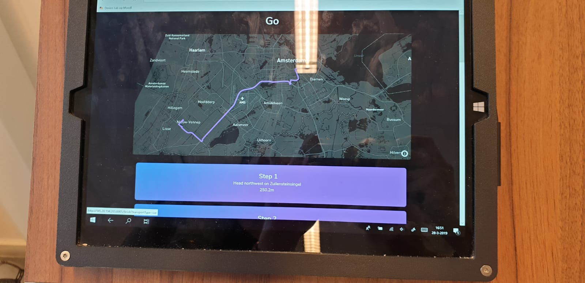
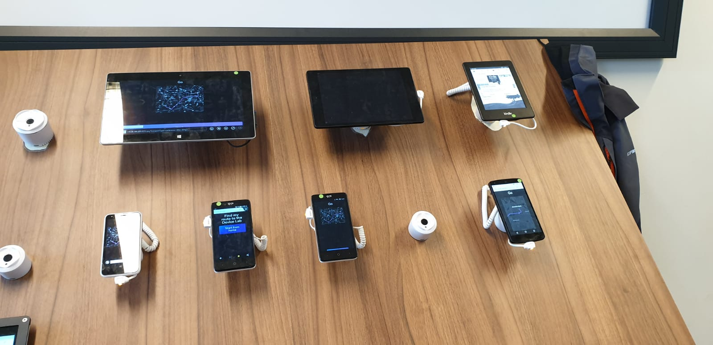

## Supplement for retake

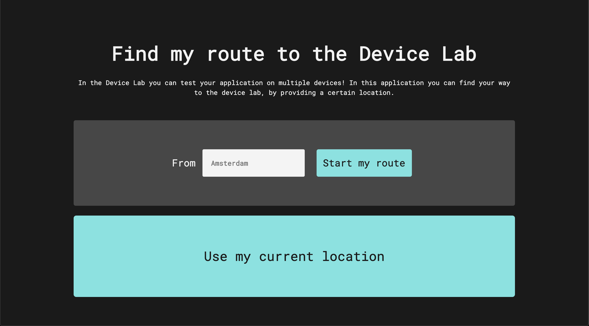

The main difference in this new application besides the styling is that the directions are server side rendered, so the user can always go from a certain location to the device lab. As was before the user could only go from **my home** in every sense of the word. I hard programmed the route from my home to the device lab. This was obviously bad practise. 
Now the user can go from their **own home** or any location for that matter even when Javascript is turned off. 

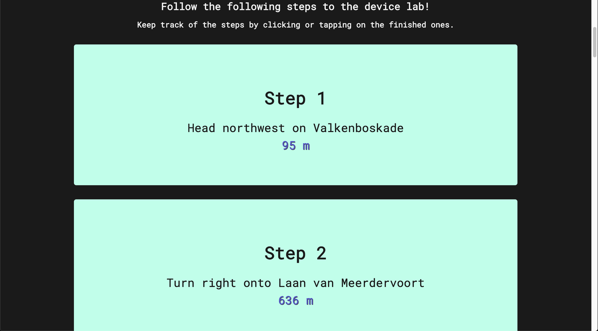

An extra feature is that the user is able to view their route on a map. At first I disabled all javascript features like geolocation and the mapbox feature toghether, but now I seperated them. So when the user isn't able to use geolocation they can still fill in their location and view the map with the directions. Ofcourse you can seperate all the features in the feature detection, but in this case wouldn't make any sense because you need all the features to add a certain feature. 

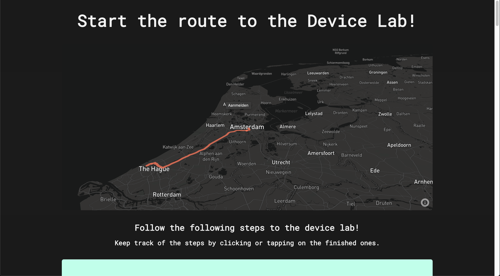

Before when a route could not be found you would get no error message, but now you will be redirected to an error page that will return you to the homepage. I changed up some content and styling, the buttons below that will link you to the steps are deleted, because they didn't just make any sense because they were displayed below. Now the user is able to check off the steps they already completed to keep track of them. In an ideal situation the user will get to choose to view their steps vertically or horizontally, however flexbox is not always supported on legacy devices, so these users will only be able to view their content vertically. The application still partially breaks around Internet Explorer 8, however in 7 the content look fine again, which is weird. The steps (directions) to the device lab can always be rendered.

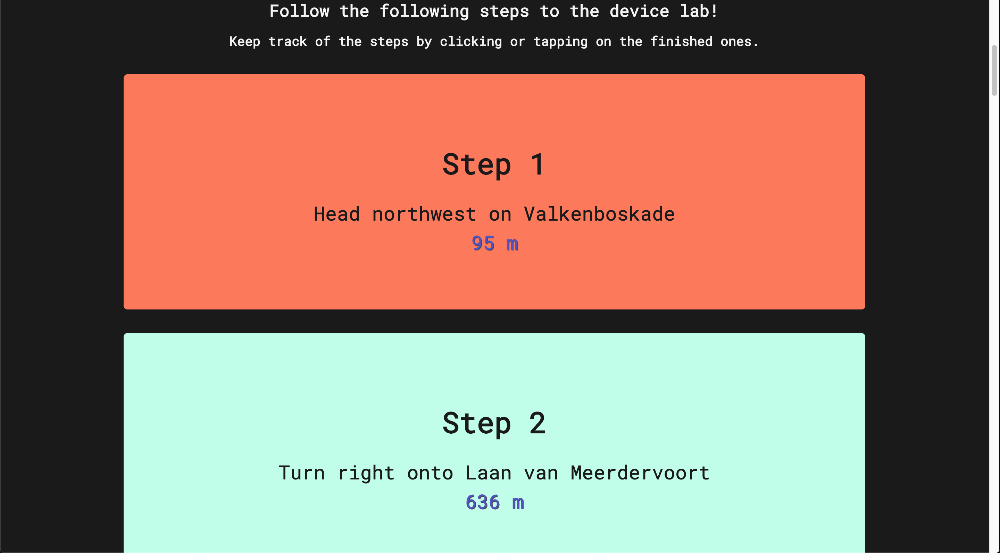

Some styles do break in certain browsers, but I either presented a fallback or it just looks less nice than it would in other browsers, but that's fine nothing really major breaks.

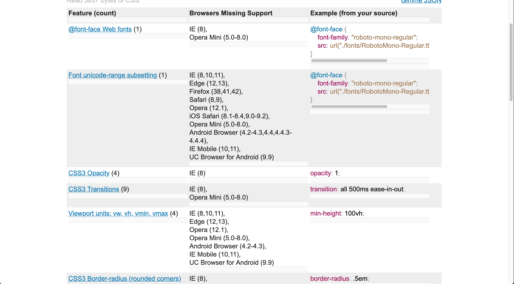
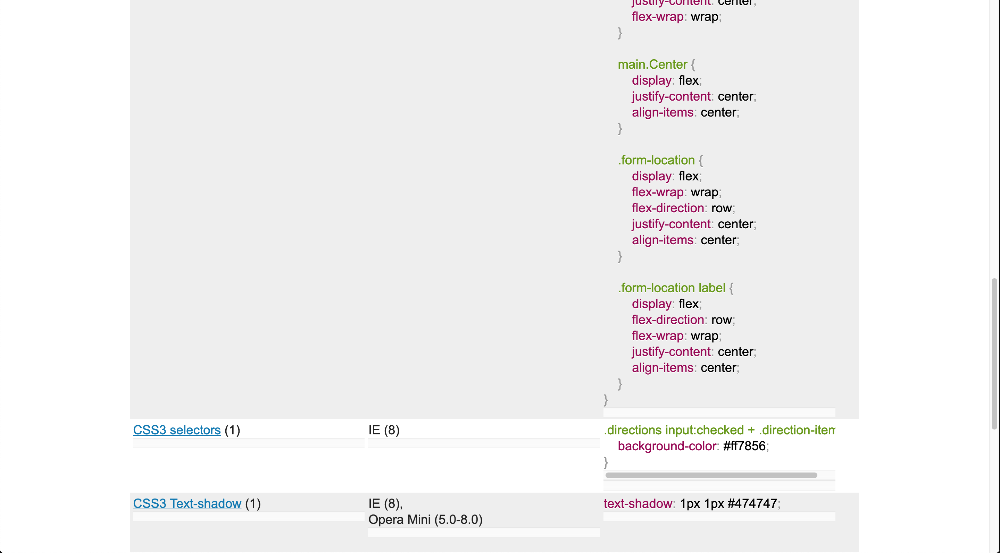

<details>
  <summary>Color accessability checker</summary>

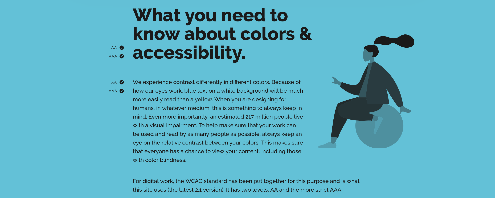
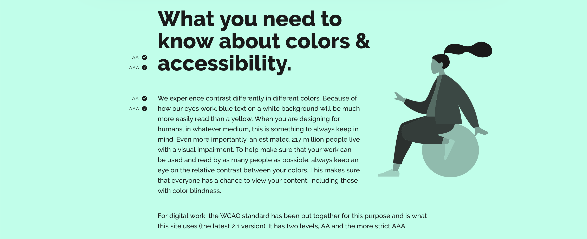
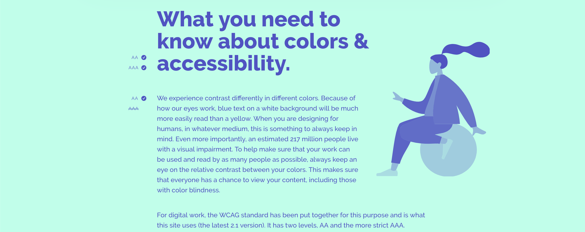
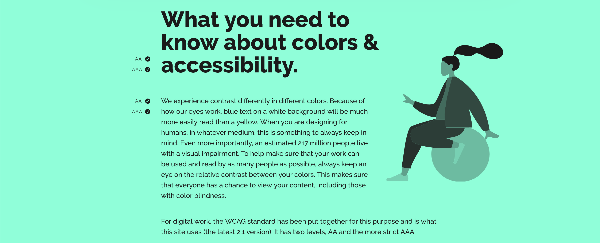
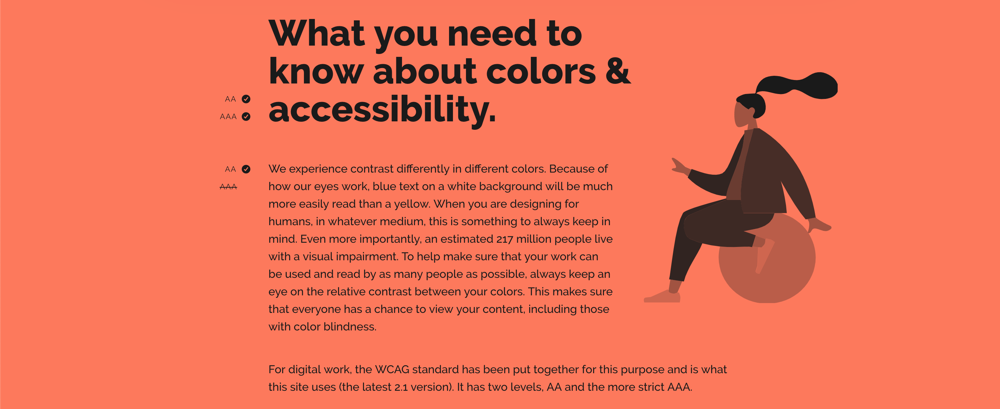

</details>


## Resources

**Feature detection**
* [Can I Use](https://caniuse.com/)
* [Do I use css that breaks](http://doiuse.herokuapp.com/)
* [Quirksmode](https://www.quirksmode.org/)
* [MDN](https://developer.mozilla.org/en-US/)

**Additional sources**
* [Mapbox](https://www.mapbox.com/)
* [Mapbox Directions](https://docs.mapbox.com/help/glossary/mapbox-directions-api/)
* [Opencage Geocoding API](https://opencagedata.com/api)

## Credits
*   **Maikel:** Helping with some feature detection and setting up Mapbox.

## License
This repository is licensed as [MIT](LICENSE) by [Chelsea Doeleman](https://github.com/chelseadoeleman).
